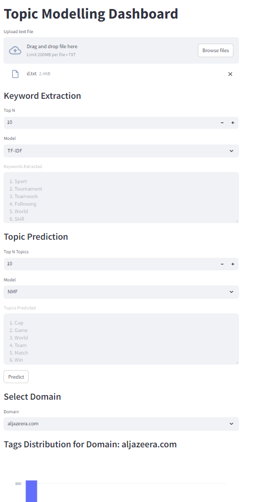
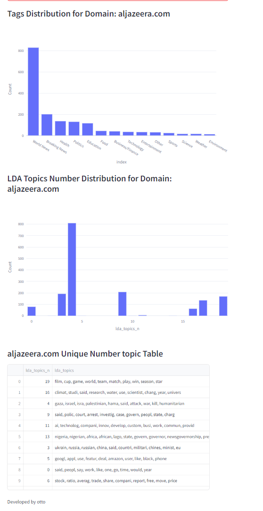

# tenx_wk0_cohort_c
This repo will hold all activity for week 0 cohort c of ten x program

# News Article Analysis for Business Insights

## Project Overview

This project aims to empower businesses by providing actionable insights derived from the analysis of news articles using advanced natural language processing (NLP) techniques. By examining a wide range of news stories, we uncover critical trends, public sentiments, and emerging topics that can significantly influence business decisions. This project helps companies anticipate market shifts, refine marketing strategies, and understand the needs and preferences of their target audience.

## Directory Structure
```
├── data/  ... # Contains the datasets used for analysis 
├── Notebooks
|  ├── EDA.ipynb # Jupyter notebook for exploratory data analysis (EDA) 
|  ├── nlp.ipynb # Jupyter notebook for NLP implementation 
├── .gitignore # Specifies files and directories to be ignored by Git
├── README.md # Project documentation (this file)
```
## Notebooks

- **EDA.ipynb**: This notebook contains the exploratory data analysis (EDA) of the datasets. It provides insights into the structure and characteristics of the data, helping to inform the NLP methodologies applied later in the project.
- **np.ipynb**: This notebook includes the implementation of natural language processing (NLP) techniques to analyze the data, extract valuable information, and generate insights.

## Data

The datasets used for this project are located in the `data` folder. These datasets contain the news articles that are analyzed to provide business insights.

## Getting Started

### Prerequisites

To run the notebooks, you will need Python and the necessary libraries. You can install the required dependencies by running:

```bash
pip install -r requirements.txt
```
### Running the Notebooks
Clone the repository:
```bash
git clone https://github.com/your-repository.git
cd your-repository
```
### Run Jupyter Notebooks:
```bash
jupyter notebook
```

### Open and execute the cells in EDA.ipynb and np.ipynb as needed.

## Topic Modelling Dashboard

### Overview
This dashboard is designed to assist with keyword extraction and topic modeling on uploaded text files. The app provides an interactive interface for users to select models, specify parameters, and visualize the results.

### Screenshots
#### Screenshot 1


#### Screenshot 2


### How to Use
1. **Upload a Text File**: Use the "Upload text file" option to upload a `.txt` file containing the article or text you wish to analyze.
2. **Keyword Extraction**:
    - Select the number of top keywords to extract using the "Top N" entry box.
    - Choose a model from the dropdown (e.g., TF-IDF, YAKE).
    - The extracted keywords will be displayed in the scrollable text area below.
3. **Topic Prediction**:
    - Select the number of top topics to predict using the "Top N Topics" entry box.
    - Choose a model from the dropdown (e.g., LDA, NMF).
    - The predicted topics will be displayed in the scrollable text area below.
4. **Domain Selection**: Choose a domain from the dropdown list to analyze specific domain-related topics and sentiments.
5. **Bar Graphs**:
    - The dashboard displays bar graphs of topics and sentiments based on the selected domain.
6. **Predict**: Click the "Predict" button to trigger the prediction functionality (note: dummy functionality for now).


## Git Ignore
The .gitignore file is located in the root folder and specifies files and directories that should not be tracked by Git. Make sure to review it to ensure all sensitive or unnecessary files are excluded from version control.

## Contributing
If you would like to contribute to this project, please create a new branch and submit a pull request.

## License
This project is licensed under the MIT License. See the LICENSE file for more details.

This version correctly formats the instructions for running the notebooks and includes the steps in Markdown.

